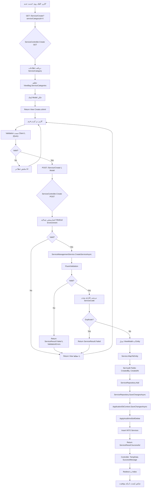
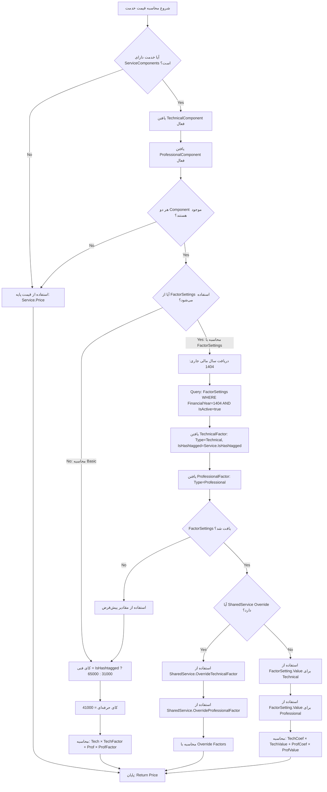

# 🔄 **Flow Chart کامل ماژول Service - از Controller تا Database**

> **پروژه**: کلینیک شفا  
> **ماژول**: Service Management  
> **تاریخ**: 1404/07/11  
> **نوع**: تحلیل جامع Flow-based  

---

## 📑 **فهرست**

1. [نمای کلی ماژول](#نمای-کلی-ماژول)
2. [معماری لایه‌ای](#معماری-لایه‌ای)
3. [Flow Chart ایجاد خدمت](#flow-chart-ایجاد-خدمت)
4. [Flow Chart محاسبه قیمت](#flow-chart-محاسبه-قیمت)
5. [جزئیات هر لایه](#جزئیات-هر-لایه)
6. [وابستگی‌ها و Dependencies](#وابستگی‌ها-و-dependencies)
7. [Data Flow](#data-flow)

---

## 🎯 **نمای کلی ماژول**

### **مسئولیت‌های ماژول Service:**

1. ✅ **مدیریت خدمات پزشکی** (CRUD کامل)
2. ✅ **مدیریت دسته‌بندی خدمات** (ServiceCategory)
3. ✅ **محاسبه قیمت خدمات** (بر اساس اجزای فنی/حرفه‌ای)
4. ✅ **مدیریت اجزای خدمت** (ServiceComponents)
5. ✅ **مدیریت خدمات مشترک** (SharedServices)
6. ✅ **محاسبات مالی** (با استفاده از FactorSettings)
7. ✅ **اعتبارسنجی چندلایه** (Medical Environment)

---

## 🏗️ **معماری لایه‌ای**

```
┌──────────────────────────────────────────────────────────────┐
│                    🌐 **Presentation Layer**                 │
│                     (Views + JavaScript)                     │
│  ┌────────────┐  ┌────────────┐  ┌────────────┐            │
│  │ Index.cshtml│  │Create.cshtml│  │Edit.cshtml│            │
│  └──────┬─────┘  └──────┬─────┘  └──────┬─────┘            │
│         │                │                │                  │
│         └────────────────┴────────────────┘                  │
└──────────────────────┬───────────────────────────────────────┘
                       │ HTTP Request (GET/POST)
                       ↓
┌──────────────────────────────────────────────────────────────┐
│                    🎮 **Controller Layer**                   │
│                   ServiceController.cs                       │
│  ┌──────────────────────────────────────────────────────┐  │
│  │ • Create(GET)      • Create(POST)                    │  │
│  │ • Edit(GET)        • Edit(POST)                      │  │
│  │ • Index(GET)       • Delete(POST)                    │  │
│  │ • Details(GET)     • CheckServiceCode(POST)          │  │
│  └──────────────────────────────────────────────────────┘  │
│         │                                                    │
│         │ Validation + Anti-Forgery + Logging                │
│         ↓                                                    │
└──────────────────────┬───────────────────────────────────────┘
                       │ Calls Service Methods
                       ↓
┌──────────────────────────────────────────────────────────────┐
│                   💼 **Service Layer**                       │
│              ServiceManagementService.cs                     │
│  ┌──────────────────────────────────────────────────────┐  │
│  │ • CreateServiceAsync()                               │  │
│  │ • UpdateServiceAsync()                               │  │
│  │ • GetServiceDetailsAsync()                           │  │
│  │ • SoftDeleteServiceAsync()                           │  │
│  │ • GetServicesAsync() [Paged]                         │  │
│  │ • IsServiceCodeDuplicateAsync()                      │  │
│  └──────────────────────────────────────────────────────┘  │
│         │                                                    │
│         │ Business Logic + FluentValidation                  │
│         │ + ServiceCalculationService                        │
│         ↓                                                    │
└──────────────────────┬───────────────────────────────────────┘
                       │ Calls Repository Methods
                       ↓
┌──────────────────────────────────────────────────────────────┐
│                   🗄️ **Repository Layer**                   │
│                    ServiceRepository.cs                      │
│  ┌──────────────────────────────────────────────────────┐  │
│  │ • GetByIdAsync()                                     │  │
│  │ • GetServicesAsync()                                 │  │
│  │ • Add()                                              │  │
│  │ │ Update()                                              │  │
│  │ • Delete()                                           │  │
│  │ • SaveChangesAsync()                                 │  │
│  │ • DoesServiceCodeExistGloballyAsync()                │  │
│  └──────────────────────────────────────────────────────┘  │
│         │                                                    │
│         │ EF6 LINQ Queries + AsNoTracking                   │
│         ↓                                                    │
└──────────────────────┬───────────────────────────────────────┘
                       │ Entity Framework 6
                       ↓
┌──────────────────────────────────────────────────────────────┐
│                    💾 **Database Layer**                     │
│                   SQL Server Database                        │
│  ┌──────────────────────────────────────────────────────┐  │
│  │ Tables:                                              │  │
│  │ • Services (Main)                                    │  │
│  │ • ServiceComponents (Fنی/حرفه‌ای)                  │  │
│  │ • ServiceCategories                                  │  │
│  │ • ServiceTemplates                                   │  │
│  │ • SharedServices (Override)                          │  │
│  │ • FactorSettings (کای‌ها)                           │  │
│  └──────────────────────────────────────────────────────┘  │
└──────────────────────────────────────────────────────────────┘
```

---

## 📝 **Flow Chart: ایجاد خدمت جدید**

### **🔸 Step-by-Step Process:**



---

## 💰 **Flow Chart: محاسبه قیمت خدمت**

### **فرمول محاسبه:**

```
قیمت = (ضریب فنی × کای فنی) + (ضریب حرفه‌ای × کای حرفه‌ای)
```

### **🔸 Step-by-Step Process:**



---

## 🧩 **جزئیات هر لایه**

### **1️⃣ Controller Layer: `ServiceController.cs`**

#### **مسئولیت‌ها:**
- ✅ دریافت HTTP Requests
- ✅ اعتبارسنجی چندلایه Medical Environment
- ✅ مدیریت ViewBag و TempData
- ✅ Anti-Forgery Token Validation
- ✅ Logging تمام عملیات
- ✅ Return Views یا Json Results

#### **متدهای کلیدی:**

##### **🔹 Create (GET):**
```csharp
public async Task<ActionResult> Create(int serviceCategoryId)
{
    // 1. لاگ درخواست
    _log.Information("🏥 MEDICAL: درخواست فرم ایجاد خدمت. CategoryId: {CategoryId}", serviceCategoryId);
    
    // 2. دریافت اطلاعات ServiceCategory
    var categoryResult = await _serviceManagementService.GetServiceCategoryDetailsAsync(serviceCategoryId);
    
    // 3. بررسی موفقیت
    if (!categoryResult.Success)
    {
        TempData["ErrorMessage"] = "دسته‌بندی خدمات مورد نظر یافت نشد.";
        return RedirectToAction("Categories");
    }
    
    // 4. ایجاد Model خالی
    var model = new ServiceCreateEditViewModel
    {
        ServiceCategoryId = serviceCategoryId,
        IsActive = true
    };
    
    // 5. تنظیم ViewBag برای DropDownList
    await SetServiceCategoriesViewBagForMedicalEnvironment(
        categoryResult.Data.DepartmentId, serviceCategoryId);
    
    // 6. اطلاعات اضافی برای UI
    ViewBag.CurrentUserName = _currentUserService.UserName ?? "کاربر سیستم";
    ViewBag.ServiceCategoryName = categoryResult.Data.Title;
    ViewBag.DepartmentName = categoryResult.Data.DepartmentName;
    
    // 7. Return View
    return View("Create", model);
}
```

##### **🔹 Create (POST):**
```csharp
[HttpPost]
[ValidateAntiForgeryToken]
public async Task<ActionResult> Create(ServiceCreateEditViewModel model)
{
    try
    {
        // 1. لاگ درخواست
        _log.Information("🏥 MEDICAL: پردازش ایجاد خدمت. Title: {Title}", model?.Title);
        
        // 2. اعتبارسنجی چندلایه Medical Environment
        var validationResult = await ValidateServiceForMedicalEnvironment(model);
        if (!validationResult.IsValid)
        {
            foreach (var error in validationResult.Errors)
            {
                ModelState.AddModelError(error.Field, error.Message);
            }
            await SetServiceCategoriesViewBagForMedicalEnvironment(...);
            return View("Create", model);
        }
        
        // 3. بررسی ModelState
        if (!ModelState.IsValid)
        {
            await SetServiceCategoriesViewBagForMedicalEnvironment(...);
            return View("Create", model);
        }
        
        // 4. فراخوانی Service Layer
        var result = await _serviceManagementService.CreateServiceAsync(model);
        
        // 5. بررسی نتیجه
        if (result.Success)
        {
            _log.Information("🏥 MEDICAL: خدمت با موفقیت ایجاد شد. Title: {Title}", model.Title);
            TempData["SuccessMessage"] = result.Message;
            return RedirectToAction("Index", new { serviceCategoryId = model.ServiceCategoryId });
        }
        
        // 6. مدیریت خطاها
        if (result.ValidationErrors?.Count > 0)
        {
            foreach (var error in result.ValidationErrors)
            {
                ModelState.AddModelError(error.Field, error.ErrorMessage);
            }
        }
        else
        {
            ModelState.AddModelError("", result.Message);
        }
        
        await SetServiceCategoriesViewBagForMedicalEnvironment(...);
        return View("Create", model);
    }
    catch (Exception ex)
    {
        _log.Error(ex, "🏥 MEDICAL: خطا در ایجاد خدمت");
        ModelState.AddModelError("", "خطای سیستمی رخ داد.");
        return View("Create", model);
    }
}
```

##### **🔹 اعتبارسنجی Medical Environment:**
```csharp
private Task<MedicalValidationResult> ValidateServiceForMedicalEnvironment(ServiceCreateEditViewModel model)
{
    var result = new MedicalValidationResult { IsValid = true };
    
    // 1. اعتبارسنجی عنوان
    if (string.IsNullOrWhiteSpace(model?.Title))
    {
        result.Errors.Add(new MedicalValidationError("Title", "عنوان خدمت الزامی است"));
        result.IsValid = false;
    }
    else if (model.Title.Length < 3 || model.Title.Length > 250)
    {
        result.Errors.Add(new MedicalValidationError("Title", "عنوان خدمت باید بین 3 تا 250 کاراکتر باشد"));
        result.IsValid = false;
    }
    
    // 2. اعتبارسنجی کد خدمت (فقط اعداد برای Medical Environment)
    if (string.IsNullOrWhiteSpace(model?.ServiceCode))
    {
        result.Errors.Add(new MedicalValidationError("ServiceCode", "کد خدمت الزامی است"));
        result.IsValid = false;
    }
    else if (!Regex.IsMatch(model.ServiceCode.Trim(), @"^\d+$"))
    {
        result.Errors.Add(new MedicalValidationError("ServiceCode", "کد خدمت باید فقط شامل اعداد باشد"));
        result.IsValid = false;
    }
    else if (model.ServiceCode.Trim().Length < 3 || model.ServiceCode.Trim().Length > 10)
    {
        result.Errors.Add(new MedicalValidationError("ServiceCode", "کد خدمت باید بین 3 تا 10 رقم باشد"));
        result.IsValid = false;
    }
    
    // 3. اعتبارسنجی قیمت
    if (model.Price <= 0)
    {
        result.Errors.Add(new MedicalValidationError("Price", "قیمت خدمت باید بزرگتر از صفر باشد"));
        result.IsValid = false;
    }
    else if (model.Price > 999999999)
    {
        result.Errors.Add(new MedicalValidationError("Price", "قیمت خدمت نمی‌تواند بیشتر از 999,999,999 تومان باشد"));
        result.IsValid = false;
    }
    else if (model.Price % 1000 != 0)
    {
        result.Errors.Add(new MedicalValidationError("Price", "قیمت خدمت باید مضرب 1000 تومان باشد"));
        result.IsValid = false;
    }
    
    // 4. اعتبارسنجی دسته‌بندی
    if (model.ServiceCategoryId <= 0)
    {
        result.Errors.Add(new MedicalValidationError("ServiceCategoryId", "انتخاب دسته‌بندی الزامی است"));
        result.IsValid = false;
    }
    
    // 5. اعتبارسنجی توضیحات
    if (!string.IsNullOrWhiteSpace(model?.Description) && model.Description.Length > 1000)
    {
        result.Errors.Add(new MedicalValidationError("Description", "توضیحات خدمت نمی‌تواند بیشتر از 1000 کاراکتر باشد"));
        result.IsValid = false;
    }
    
    return Task.FromResult(result);
}
```

---

### **2️⃣ Service Layer: `ServiceManagementService.cs`**

#### **مسئولیت‌ها:**
- ✅ پیاده‌سازی Business Logic
- ✅ Orchestration بین Repositories
- ✅ FluentValidation
- ✅ مدیریت تراکنش‌ها
- ✅ Logging تخصصی
- ✅ Return کردن `ServiceResult<T>`

#### **متدهای کلیدی:**

##### **🔹 CreateServiceAsync:**
```csharp
public async Task<ServiceResult> CreateServiceAsync(ServiceCreateEditViewModel model)
{
    _log.Information("درخواست ایجاد خدمت. Title: {Title}, User: {UserId}", 
        model?.Title, _currentUserService.UserId);
    
    try
    {
        // 1. اعتبارسنجی با FluentValidation
        var validationResult = await _serviceValidator.ValidateAsync(model);
        if (!validationResult.IsValid)
        {
            var errors = validationResult.Errors.Select(e => 
                new ValidationError(e.PropertyName, e.ErrorMessage));
            return ServiceResult.FailedWithValidationErrors("اطلاعات ورودی نامعتبر است.", errors);
        }
        
        // 2. بررسی تکراری بودن کد خدمت
        var isDuplicate = await _serviceRepo.DoesServiceCodeExistGloballyAsync(
            model.ServiceCode, model.ServiceId);
        if (isDuplicate)
        {
            return ServiceResult.Failed("کد خدمت تکراری است.", "DUPLICATE_CODE");
        }
        
        // 3. تبدیل ViewModel به Entity
        var service = new Service
        {
            Title = model.Title.Trim(),
            ServiceCode = model.ServiceCode.Trim(),
            Price = model.Price,
            Description = model.Description?.Trim(),
            ServiceCategoryId = model.ServiceCategoryId,
            IsActive = model.IsActive,
            Notes = model.Notes?.Trim(),
            IsHashtagged = model.IsHashtagged,
            // CreatedAt و CreatedByUserId به صورت خودکار توسط ApplicationDbContext تنظیم می‌شود
        };
        
        // 4. افزودن به Repository
        _serviceRepo.Add(service);
        
        // 5. ذخیره تغییرات
        await _serviceRepo.SaveChangesAsync();
        
        _log.Information("خدمت با موفقیت ایجاد شد. ServiceId: {ServiceId}, Title: {Title}, User: {UserId}", 
            service.ServiceId, service.Title, _currentUserService.UserId);
        
        return ServiceResult.Successful("خدمت با موفقیت ایجاد شد.");
    }
    catch (Exception ex)
    {
        _log.Error(ex, "خطا در ایجاد خدمت. Title: {Title}, User: {UserId}", 
            model?.Title, _currentUserService.UserId);
        return ServiceResult.Failed("خطا در ایجاد خدمت.", "DB_ERROR");
    }
}
```

##### **🔹 IsServiceCodeDuplicateAsync:**
```csharp
public async Task<bool> IsServiceCodeDuplicateAsync(string serviceCode, int? serviceCategoryId, int? excludeServiceId)
{
    try
    {
        return await _serviceRepo.DoesServiceCodeExistGloballyAsync(serviceCode, excludeServiceId);
    }
    catch (Exception ex)
    {
        _log.Error(ex, "خطا در بررسی تکراری بودن کد خدمت");
        throw;
    }
}
```

---

### **3️⃣ Repository Layer: `ServiceRepository.cs`**

#### **مسئولیت‌ها:**
- ✅ دسترسی مستقیم به Database
- ✅ LINQ Queries بهینه‌شده
- ✅ AsNoTracking برای Read-Only
- ✅ Include برای Eager Loading
- ✅ پیاده‌سازی الگوی Repository

#### **متدهای کلیدی:**

##### **🔹 GetByIdAsync:**
```csharp
public Task<Service> GetByIdAsync(int id)
{
    // Eagerly load related data needed for Details views.
    // No .AsNoTracking() as the service might intend to update this entity.
    return _context.Services
        .Include(s => s.ServiceCategory.Department.Clinic)  // ✅ 3 سطح روابط
        .Include(s => s.CreatedByUser)
        .Include(s => s.UpdatedByUser)
        .FirstOrDefaultAsync(s => s.ServiceId == id);
}
```

##### **🔹 GetServicesAsync:**
```csharp
public async Task<List<Service>> GetServicesAsync(int serviceCategoryId, string searchTerm)
{
    var query = _context.Services
        .AsNoTracking()  // ✅ Read-Only Performance
        .Where(s => s.ServiceCategoryId == serviceCategoryId);
    
    if (!string.IsNullOrWhiteSpace(searchTerm))
    {
        var normalizedTerm = searchTerm.Trim();
        query = query.Where(s => 
            s.Title.Contains(normalizedTerm) || 
            s.ServiceCode.Contains(normalizedTerm));
    }
    
    return await query.OrderBy(s => s.Title).ToListAsync();
}
```

##### **🔹 DoesServiceCodeExistGloballyAsync:**
```csharp
public Task<bool> DoesServiceCodeExistGloballyAsync(string serviceCode, int? excludeServiceId = null)
{
    var query = _context.Services
        .AsNoTracking()  // ✅ سریع‌ترین
        .Where(s => s.ServiceCode == serviceCode);
    
    if (excludeServiceId.HasValue)
    {
        query = query.Where(s => s.ServiceId != excludeServiceId.Value);
    }
    
    return query.AnyAsync();  // ✅ AnyAsync بهتر از CountAsync
}
```

##### **🔹 Add & SaveChangesAsync:**
```csharp
public void Add(Service service)
{
    _context.Services.Add(service);
}

public Task SaveChangesAsync()
{
    return _context.SaveChangesAsync();
    // ApplicationDbContext.SaveChangesAsync automatically:
    // 1. Calls ApplyAuditAndSoftDelete()
    // 2. Sets CreatedAt, CreatedByUserId
    // 3. Sets UpdatedAt, UpdatedByUserId (for modified entities)
    // 4. Handles Soft Delete (IsDeleted, DeletedAt, DeletedByUserId)
}
```

---

### **4️⃣ ViewModel Layer: `ServiceViewModels.cs`**

#### **مسئولیت‌ها:**
- ✅ Data Transfer Objects
- ✅ Factory Method Pattern
- ✅ Data Annotations Validation
- ✅ Persian Date Formatting
- ✅ Business Logic FREE

#### **مدل‌های کلیدی:**

##### **🔹 ServiceCreateEditViewModel:**
```csharp
public class ServiceCreateEditViewModel
{
    public int ServiceId { get; set; }

    [Required(ErrorMessage = "وارد کردن عنوان الزامی است.")]
    [StringLength(200)]
    public string Title { get; set; }

    [Required(ErrorMessage = "وارد کردن کد خدمت الزامی است.")]
    [StringLength(50)]
    public string ServiceCode { get; set; }

    [Required(ErrorMessage = "وارد کردن قیمت الزامی است.")]
    [Range(0, double.MaxValue)]
    public decimal Price { get; set; }

    [StringLength(1000)]
    public string Description { get; set; }

    [Required]
    public int ServiceCategoryId { get; set; }

    public bool IsActive { get; set; } = true;

    public bool IsHashtagged { get; set; } = false;

    public ServicePriceCalculationType PriceCalculationType { get; set; } = ServicePriceCalculationType.ComponentBased;

    // ✅ Factory Method Pattern
    public static ServiceCreateEditViewModel FromEntity(Service service)
    {
        if (service == null) return null;
        
        return new ServiceCreateEditViewModel
        {
            ServiceId = service.ServiceId,
            Title = service.Title,
            ServiceCode = service.ServiceCode,
            Price = service.Price,
            Description = service.Description,
            ServiceCategoryId = service.ServiceCategoryId,
            IsActive = service.IsActive,
            Notes = service.Notes,
            IsHashtagged = service.IsHashtagged,
            PriceCalculationType = ServicePriceCalculationType.ComponentBased,
            ServiceCategoryTitle = service.ServiceCategory?.Title,
            DepartmentId = service.ServiceCategory?.DepartmentId ?? 0,
            CreatedAt = service.CreatedAt,
            CreatedBy = service.CreatedByUser?.FullName,
            UpdatedAt = service.UpdatedAt,
            UpdatedBy = service.UpdatedByUser?.FullName,
            CreatedAtShamsi = service.CreatedAt.ToPersianDateTime(),
            UpdatedAtShamsi = service.UpdatedAt?.ToPersianDateTime()
        };
    }

    // ✅ Mapping به Entity
    public void MapToEntity(Service service)
    {
        if (service == null) return;
        
        service.Title = this.Title?.Trim();
        service.ServiceCode = this.ServiceCode?.Trim();
        service.Price = this.Price;
        service.Description = this.Description?.Trim();
        service.ServiceCategoryId = this.ServiceCategoryId;
        service.IsActive = this.IsActive;
        service.Notes = this.Notes?.Trim();
        service.IsHashtagged = this.IsHashtagged;
    }
}
```

##### **🔹 ServiceIndexViewModel:**
```csharp
public class ServiceIndexViewModel
{
    public int ServiceId { get; set; }
    public string Title { get; set; }
    public string ServiceCode { get; set; }
    public decimal Price { get; set; }
    public string PriceFormatted { get; set; }
    public bool IsActive { get; set; }
    public string ServiceCategoryTitle { get; set; }
    public string CreatedAtShamsi { get; set; }

    public static ServiceIndexViewModel FromEntity(Service service)
    {
        if (service == null) return null;
        
        return new ServiceIndexViewModel
        {
            ServiceId = service.ServiceId,
            Title = service.Title,
            ServiceCode = service.ServiceCode,
            Price = service.Price,
            PriceFormatted = service.Price.ToString("N0"),  // ✅ فرمت فارسی
            IsActive = service.IsActive,
            ServiceCategoryTitle = service.ServiceCategory?.Title,
            CreatedAtShamsi = service.CreatedAt.ToPersianDateTime()
        };
    }
}
```

---

### **5️⃣ View Layer: `Create.cshtml` و `Index.cshtml`**

#### **ویژگی‌های کلیدی:**

##### **🔹 Create.cshtml:**
- ✅ **Bootstrap + Select2** برای UI
- ✅ **Client-Side Validation** با jQuery
- ✅ **Anti-Forgery Token**
- ✅ **AJAX Validation** برای ServiceCode
- ✅ **Medical Environment Standards**
- ✅ **Keyboard Shortcuts** (Ctrl+Enter for submit)
- ✅ **Security Features** (Input Sanitization)

**بخش‌های مهم:**

```html
<!-- فرم اصلی -->
@using (Html.BeginForm("Create", "Service", FormMethod.Post, new { @class = "needs-validation" }))
{
    @Html.AntiForgeryToken()
    
    <!-- عنوان خدمت -->
    <div class="mb-4">
        @Html.LabelFor(model => model.Title, new { @class = "form-label required" })
        @Html.TextBoxFor(model => model.Title, new { 
            @class = "form-control", 
            placeholder = "عنوان خدمات را وارد کنید",
            autofocus = "autofocus",
            required = "required",
            minlength = "3",
            maxlength = "250"
        })
        @Html.ValidationMessageFor(model => model.Title)
    </div>
    
    <!-- کد خدمت -->
    <div class="mb-4">
        @Html.LabelFor(model => model.ServiceCode, new { @class = "form-label required" })
        @Html.TextBoxFor(model => model.ServiceCode, new { 
            @class = "form-control",
            placeholder = "کد خدمات را وارد کنید",
            required = "required",
            pattern = "^[0-9]{3,10}$"  // فقط اعداد 3-10 رقم
        })
        @Html.ValidationMessageFor(model => model.ServiceCode)
    </div>
    
    <!-- قیمت -->
    <div class="mb-4">
        @Html.LabelFor(model => model.Price, new { @class = "form-label required" })
        @Html.TextBoxFor(model => model.Price, new { 
            @class = "form-control",
            type = "number",
            min = "1000",
            max = "999999999",
            step = "1000"  // مضرب 1000
        })
        @Html.ValidationMessageFor(model => model.Price)
    </div>
}
```

**JavaScript Validation:**

```javascript
// 🔒 اعتبارسنجی AJAX کد خدمت
$('#ServiceCode').on('blur', function() {
    var serviceCode = $(this).val();
    
    // بررسی الگو
    if (!/^\d{3,10}$/.test(serviceCode)) {
        showFieldError($(this), 'کد خدمت باید بین 3 تا 10 رقم باشد');
        return;
    }
    
    // بررسی تکراری بودن
    $.ajax({
        url: '@Url.Action("CheckServiceCode", "Service")',
        type: 'POST',
        data: { 
            serviceCode: serviceCode,
            __RequestVerificationToken: $('input[name="__RequestVerificationToken"]').val()
        },
        success: function(response) {
            if (!response.isAvailable) {
                showFieldError($('#ServiceCode'), response.message);
            }
        }
    });
});
```

##### **🔹 Index.cshtml:**
- ✅ **Dual View Mode**: Table + Card
- ✅ **Advanced Search** با فیلترهای متعدد
- ✅ **Pagination** با AJAX
- ✅ **Real-time Statistics**
- ✅ **Delete Confirmation** با Modal
- ✅ **Medical Security** (Context Menu Disabled)

---

## 🔄 **منطق محاسبه قیمت: ServiceCalculationService**

### **🎯 دو روش محاسبه:**

#### **1. محاسبه Basic (بدون FactorSettings):**

```csharp
public decimal CalculateServicePrice(Service service)
{
    // بررسی وجود ServiceComponents
    if (service.ServiceComponents != null && service.ServiceComponents.Any())
    {
        var technicalComponent = service.ServiceComponents
            .FirstOrDefault(sc => sc.ComponentType == ServiceComponentType.Technical 
                                && sc.IsActive && !sc.IsDeleted);

        var professionalComponent = service.ServiceComponents
            .FirstOrDefault(sc => sc.ComponentType == ServiceComponentType.Professional 
                                && sc.IsActive && !sc.IsDeleted);

        if (technicalComponent != null && professionalComponent != null)
        {
            // کای‌های ثابت
            decimal technicalFactor = service.IsHashtagged ? 65000 : 31000;
            decimal professionalFactor = 41000;
            
            // فرمول محاسبه
            return (technicalComponent.Coefficient * technicalFactor) + 
                   (professionalComponent.Coefficient * professionalFactor);
        }
    }

    // اگر اجزا تعریف نشده‌اند، از قیمت پایه استفاده کن
    return service.Price;
}
```

**مثال:**
```
خدمت: معاینه عمومی
• ضریب فنی: 1.5
• ضریب حرفه‌ای: 2.0
• هشتگ‌دار: false

محاسبه:
  قیمت = (1.5 × 31000) + (2.0 × 41000)
       = 46500 + 82000
       = 128,500 ریال
       = 12,850 تومان
```

---

#### **2. محاسبه با FactorSettings (پیشرفته):**

```csharp
public decimal CalculateServicePriceWithFactorSettings(
    Service service, 
    ApplicationDbContext context, 
    DateTime calculationDate)
{
    // 1. بررسی وجود اجزای خدمت
    if (!HasCompleteComponents(service))
    {
        return service.Price;
    }

    // 2. دریافت سال مالی
    var persianCalendar = new System.Globalization.PersianCalendar();
    var financialYear = persianCalendar.GetYear(calculationDate);

    // 3. دریافت کای‌ها از دیتابیس
    var technicalFactor = context.FactorSettings
        .Where(fs => fs.FactorType == ServiceComponentType.Technical
                  && fs.IsHashtagged == service.IsHashtagged
                  && fs.FinancialYear == financialYear
                  && fs.IsActiveForCurrentYear
                  && !fs.IsDeleted)
        .OrderByDescending(fs => fs.EffectiveFrom)
        .FirstOrDefault();

    var professionalFactor = context.FactorSettings
        .Where(fs => fs.FactorType == ServiceComponentType.Professional
                  && fs.FinancialYear == financialYear
                  && fs.IsActiveForCurrentYear
                  && !fs.IsDeleted)
        .OrderByDescending(fs => fs.EffectiveFrom)
        .FirstOrDefault();

    // 4. بررسی وجود کای‌ها
    if (technicalFactor == null || professionalFactor == null)
    {
        // Fallback به محاسبه Basic
        return CalculateServicePrice(service);
    }

    // 5. دریافت اجزای خدمت
    var technicalComponent = GetTechnicalComponent(service);
    var professionalComponent = GetProfessionalComponent(service);

    // 6. محاسبه قیمت
    var technicalPrice = technicalComponent.Coefficient * technicalFactor.Value;
    var professionalPrice = professionalComponent.Coefficient * professionalFactor.Value;

    return technicalPrice + professionalPrice;
}
```

**مثال با FactorSettings:**
```
خدمت: معاینه عمومی
• ضریب فنی: 1.5
• ضریب حرفه‌ای: 2.0
• هشتگ‌دار: false
• سال مالی: 1404

FactorSettings (از دیتابیس):
• کای فنی (غیر هشتگ‌دار): 35,000 ریال
• کای حرفه‌ای: 45,000 ریال

محاسبه:
  قیمت = (1.5 × 35000) + (2.0 × 45000)
       = 52500 + 90000
       = 142,500 ریال
       = 14,250 تومان
```

---

#### **3. محاسبه با SharedService Override:**

```csharp
public decimal CalculateSharedServicePrice(
    Service service, 
    int departmentId,
    ApplicationDbContext context,
    DateTime calculationDate)
{
    // 1. بررسی وجود SharedService
    var sharedService = context.SharedServices
        .FirstOrDefault(ss => ss.ServiceId == service.ServiceId
                           && ss.DepartmentId == departmentId
                           && ss.IsActive
                           && !ss.IsDeleted);

    if (sharedService == null)
    {
        // اگر SharedService نداریم، از محاسبه عادی استفاده کن
        return CalculateServicePriceWithFactorSettings(service, context, calculationDate);
    }

    // 2. بررسی وجود Override
    if (sharedService.OverrideTechnicalFactor.HasValue || 
        sharedService.OverrideProfessionalFactor.HasValue)
    {
        var technicalComponent = GetTechnicalComponent(service);
        var professionalComponent = GetProfessionalComponent(service);

        // استفاده از Override اگر موجود است
        var techFactor = sharedService.OverrideTechnicalFactor ?? 
                        GetDefaultTechnicalFactor(service, context, calculationDate);
        var profFactor = sharedService.OverrideProfessionalFactor ?? 
                        GetDefaultProfessionalFactor(context, calculationDate);

        return (technicalComponent.Coefficient * techFactor) + 
               (professionalComponent.Coefficient * profFactor);
    }

    // 3. اگر Override نداریم، از محاسبه عادی استفاده کن
    return CalculateServicePriceWithFactorSettings(service, context, calculationDate);
}
```

**مثال با SharedService:**
```
خدمت: معاینه عمومی
• ضریب فنی: 1.5
• ضریب حرفه‌ای: 2.0
• دپارتمان: اورژانس
• هشتگ‌دار: false

SharedService Override (اورژانس):
• کای فنی Override: 40,000 ریال (افزایش ویژه)
• کای حرفه‌ای Override: null (استفاده از پیش‌فرض 45,000)

محاسبه:
  قیمت = (1.5 × 40000) + (2.0 × 45000)
       = 60000 + 90000
       = 150,000 ریال
       = 15,000 تومان
```

---

## 💾 **Database Layer**

### **ساختار جداول:**

#### **1. Services (Main Table):**
```sql
CREATE TABLE [dbo].[Services]
(
    [ServiceId] INT IDENTITY(1,1) PRIMARY KEY,
    [Title] NVARCHAR(200) NOT NULL,
    [ServiceCode] NVARCHAR(50) NOT NULL,
    [Price] DECIMAL(18, 0) NOT NULL DEFAULT 0,
    [Description] NVARCHAR(1000) NULL,
    [ServiceCategoryId] INT NOT NULL,
    [IsActive] BIT NOT NULL DEFAULT 1,
    [Notes] NVARCHAR(500) NULL,
    [IsHashtagged] BIT NOT NULL DEFAULT 0,
    
    -- Audit Trail
    [CreatedAt] DATETIME2 NOT NULL DEFAULT GETUTCDATE(),
    [CreatedByUserId] NVARCHAR(128) NOT NULL,
    [UpdatedAt] DATETIME2 NULL,
    [UpdatedByUserId] NVARCHAR(128) NULL,
    
    -- Soft Delete
    [IsDeleted] BIT NOT NULL DEFAULT 0,
    [DeletedAt] DATETIME2 NULL,
    [DeletedByUserId] NVARCHAR(128) NULL,
    
    -- Indexes
    CONSTRAINT [IX_Services_ServiceCode] UNIQUE ([ServiceCode]),
    INDEX [IX_Services_ServiceCategoryId] ([ServiceCategoryId]),
    INDEX [IX_Services_IsActive_IsDeleted] ([IsActive], [IsDeleted]),
    
    -- Foreign Keys
    CONSTRAINT [FK_Services_ServiceCategories] 
        FOREIGN KEY ([ServiceCategoryId]) 
        REFERENCES [dbo].[ServiceCategories]([ServiceCategoryId]),
    CONSTRAINT [FK_Services_CreatedByUser] 
        FOREIGN KEY ([CreatedByUserId]) 
        REFERENCES [dbo].[AspNetUsers]([Id]),
    CONSTRAINT [FK_Services_UpdatedByUser] 
        FOREIGN KEY ([UpdatedByUserId]) 
        REFERENCES [dbo].[AspNetUsers]([Id])
)
```

#### **2. ServiceComponents:**
```sql
CREATE TABLE [dbo].[ServiceComponents]
(
    [ServiceComponentId] INT IDENTITY(1,1) PRIMARY KEY,
    [ServiceId] INT NOT NULL,
    [ComponentType] INT NOT NULL,  -- 1=Technical, 2=Professional
    [Coefficient] DECIMAL(10, 4) NOT NULL,
    [Description] NVARCHAR(500) NULL,
    [IsActive] BIT NOT NULL DEFAULT 1,
    
    -- Audit Trail + Soft Delete
    [CreatedAt] DATETIME2 NOT NULL,
    [CreatedByUserId] NVARCHAR(128) NOT NULL,
    [IsDeleted] BIT NOT NULL DEFAULT 0,
    
    -- Indexes
    INDEX [IX_ServiceComponents_ServiceId_ComponentType] ([ServiceId], [ComponentType]),
    
    -- Foreign Keys
    CONSTRAINT [FK_ServiceComponents_Services] 
        FOREIGN KEY ([ServiceId]) 
        REFERENCES [dbo].[Services]([ServiceId]) 
        ON DELETE CASCADE
)
```

#### **3. FactorSettings (کای‌ها):**
```sql
CREATE TABLE [dbo].[FactorSettings]
(
    [FactorSettingId] INT IDENTITY(1,1) PRIMARY KEY,
    [FactorType] INT NOT NULL,  -- 1=Technical, 2=Professional
    [IsHashtagged] BIT NOT NULL DEFAULT 0,
    [Value] DECIMAL(18, 2) NOT NULL,
    [EffectiveFrom] DATETIME2 NOT NULL,
    [EffectiveTo] DATETIME2 NULL,
    [FinancialYear] INT NOT NULL,  -- 1404, 1405, ...
    [IsActiveForCurrentYear] BIT NOT NULL DEFAULT 1,
    [IsFrozen] BIT NOT NULL DEFAULT 0,
    [Description] NVARCHAR(500) NULL,
    
    -- Audit Trail + Soft Delete
    [CreatedAt] DATETIME2 NOT NULL,
    [CreatedByUserId] NVARCHAR(128) NOT NULL,
    [IsDeleted] BIT NOT NULL DEFAULT 0,
    
    -- Indexes
    INDEX [IX_FactorSettings_Type_Year_Hashtag] 
        ([FactorType], [FinancialYear], [IsHashtagged], [IsActiveForCurrentYear]),
    INDEX [IX_FactorSettings_EffectiveFrom] ([EffectiveFrom])
)
```

#### **4. SharedServices (Override):**
```sql
CREATE TABLE [dbo].[SharedServices]
(
    [SharedServiceId] INT IDENTITY(1,1) PRIMARY KEY,
    [ServiceId] INT NOT NULL,
    [DepartmentId] INT NOT NULL,
    [IsActive] BIT NOT NULL DEFAULT 1,
    [DepartmentSpecificNotes] NVARCHAR(1000) NULL,
    [OverrideTechnicalFactor] DECIMAL(18, 2) NULL,
    [OverrideProfessionalFactor] DECIMAL(18, 2) NULL,
    
    -- Audit Trail + Soft Delete
    [CreatedAt] DATETIME2 NOT NULL,
    [CreatedByUserId] NVARCHAR(128) NOT NULL,
    [IsDeleted] BIT NOT NULL DEFAULT 0,
    
    -- Unique Constraint
    CONSTRAINT [UQ_SharedServices_Service_Department] 
        UNIQUE ([ServiceId], [DepartmentId]),
    
    -- Foreign Keys
    CONSTRAINT [FK_SharedServices_Services] 
        FOREIGN KEY ([ServiceId]) 
        REFERENCES [dbo].[Services]([ServiceId]),
    CONSTRAINT [FK_SharedServices_Departments] 
        FOREIGN KEY ([DepartmentId]) 
        REFERENCES [dbo].[Departments]([DepartmentId])
)
```

---

## 🔗 **وابستگی‌ها (Dependencies)**

### **Controller Dependencies:**
```csharp
public ServiceController(
    IServiceManagementService serviceManagementService,         // ✅ Business Logic
    IDepartmentManagementService departmentService,             // ✅ Department Lookup
    ICurrentUserService currentUserService,                     // ✅ User Context
    ILogger logger,                                             // ✅ Logging
    ApplicationDbContext context,                               // ✅ Direct DB Access (for calculations)
    IServiceCalculationService serviceCalculationService)       // ✅ Price Calculations
```

### **Service Dependencies:**
```csharp
public ServiceManagementService(
    IServiceCategoryRepository categoryRepository,             // ✅ Category Data Access
    IServiceRepository serviceRepository,                       // ✅ Service Data Access
    IValidator<ServiceCategoryCreateEditViewModel> categoryValidator, // ✅ Validation
    IValidator<ServiceCreateEditViewModel> serviceValidator,    // ✅ Validation
    ICurrentUserService currentUserService,                     // ✅ User Context
    ILogger logger,                                             // ✅ Logging
    IServiceCalculationService serviceCalculationService,       // ✅ Price Calculations
    ApplicationDbContext context)                               // ✅ Direct DB Access (for complex queries)
```

### **Repository Dependencies:**
```csharp
public ServiceRepository(
    ApplicationDbContext context)                               // ✅ EF6 DbContext
```

---

## 📊 **Data Flow: Request به Response**

### **Complete Flow:**

```
1. USER ACTION
   ↓ کاربر روی "خدمت جدید" کلیک می‌کند
   
2. HTTP GET REQUEST
   ↓ Browser → /Service/Create?serviceCategoryId=5
   
3. CONTROLLER (GET)
   ↓ ServiceController.Create(GET)
   ├─ دریافت ServiceCategory از Service Layer
   ├─ تنظیم ViewBag.ServiceCategories
   ├─ ایجاد Model خالی
   └─ Return View("Create", model)
   
4. VIEW RENDERING
   ↓ Razor Engine → HTML + JavaScript
   ├─ Render فرم ایجاد
   ├─ فعال‌سازی Select2
   ├─ تنظیم Validation
   └─ نمایش به کاربر
   
5. USER INPUT
   ↓ کاربر فرم را پر می‌کند
   ├─ عنوان: "معاینه عمومی"
   ├─ کد: "10025"
   ├─ قیمت: "150000"
   ├─ دسته‌بندی: "معاینات"
   └─ کلیک روی "ذخیره"
   
6. CLIENT VALIDATION
   ↓ jQuery Validation
   ├─ بررسی Required Fields
   ├─ بررسی Pattern (کد فقط اعداد)
   ├─ بررسی Min/Max Length
   ├─ AJAX Check: ServiceCode Duplicate
   └─ Valid? → Submit Form
   
7. HTTP POST REQUEST
   ↓ Browser → /Service/Create [POST]
   └─ Model: ServiceCreateEditViewModel
   
8. CONTROLLER (POST)
   ↓ ServiceController.Create(POST)
   ├─ ValidateAntiForgeryToken()
   ├─ اعتبارسنجی Medical Environment
   │  ├─ عنوان: 3-250 کاراکتر
   │  ├─ کد: 3-10 رقم، فقط اعداد
   │  ├─ قیمت: مضرب 1000، حداکثر 999M
   │  └─ دسته‌بندی: > 0
   ├─ ModelState.IsValid?
   └─ Call Service Layer
   
9. SERVICE LAYER
   ↓ ServiceManagementService.CreateServiceAsync()
   ├─ FluentValidation
   │  └─ ServiceCreateEditViewModelValidator.ValidateAsync()
   ├─ بررسی Duplicate ServiceCode
   │  └─ ServiceRepository.DoesServiceCodeExistGloballyAsync()
   ├─ تبدیل ViewModel به Entity
   │  └─ new Service { ... }
   ├─ افزودن به Repository
   │  └─ ServiceRepository.Add(service)
   └─ ذخیره تغییرات
      └─ ServiceRepository.SaveChangesAsync()
      
10. REPOSITORY LAYER
    ↓ ServiceRepository.SaveChangesAsync()
    └─ _context.SaveChangesAsync()
    
11. DBCONTEXT
    ↓ ApplicationDbContext.SaveChangesAsync()
    ├─ ApplyAuditAndSoftDelete()
    │  ├─ Set CreatedAt = DateTime.UtcNow
    │  ├─ Set CreatedByUserId = CurrentUser.Id
    │  └─ Entry.State = EntityState.Added
    ├─ Generate SQL:
    │  └─ INSERT INTO Services (Title, ServiceCode, Price, ...) VALUES (...)
    └─ Execute SQL → Database
    
12. DATABASE
    ↓ SQL Server
    ├─ Validate Constraints
    ├─ Check UNIQUE (ServiceCode)
    ├─ Check Foreign Keys
    ├─ INSERT Record
    ├─ Generate ServiceId (IDENTITY)
    └─ Return Affected Rows
    
13. RESULT BACK TO SERVICE
    ↓ ServiceResult.Successful("خدمت با موفقیت ایجاد شد.")
    
14. RESULT BACK TO CONTROLLER
    ↓ if (result.Success)
    ├─ TempData["SuccessMessage"] = result.Message
    └─ RedirectToAction("Index", new { serviceCategoryId })
    
15. HTTP REDIRECT
    ↓ 302 Redirect → /Service/Index?serviceCategoryId=5
    
16. INDEX PAGE
    ↓ ServiceController.Index(GET)
    ├─ دریافت لیست خدمات
    ├─ Paging
    ├─ نمایش TempData Success
    └─ Return View با لیست
    
17. FINAL DISPLAY
    ↓ نمایش لیست خدمات با پیام موفقیت
    └─ "خدمت با موفقیت ایجاد شد." ✅
```

---

## ⚙️ **نکات کلیدی معماری**

### ✅ **Separation of Concerns:**
- **Controller**: فقط HTTP Handling و Orchestration
- **Service**: تمام Business Logic
- **Repository**: فقط Data Access
- **ViewModel**: فقط Data Transfer
- **View**: فقط Presentation

### ✅ **Dependency Injection:**
- تمام Dependencies از طریق Constructor
- استفاده از Interfaces برای Testability
- Lifetime Management با Autofac

### ✅ **Validation چندلایه:**
1. **Client-Side**: jQuery Validation (UX)
2. **Controller**: Medical Environment Validation (Security)
3. **Service**: FluentValidation (Business Rules)
4. **Database**: Constraints (Data Integrity)

### ✅ **Audit Trail خودکار:**
- `CreatedAt`, `CreatedByUserId` → ثبت در Add
- `UpdatedAt`, `UpdatedByUserId` → ثبت در Update
- `DeletedAt`, `DeletedByUserId` → ثبت در Soft Delete

### ✅ **Soft Delete:**
- هیچ Entity ای Physical Delete نمی‌شود
- فقط `IsDeleted = true` می‌شود
- Query ها همیشه `!IsDeleted` چک می‌کنند

### ✅ **Factory Method Pattern:**
- هیچ AutoMapper استفاده نمی‌شود
- تبدیل‌ها با `FromEntity()` و `MapToEntity()` دستی
- کنترل کامل روی Mapping Logic

### ✅ **ServiceResult Pattern:**
- نتیجه‌های یکپارچه با Success/Failed
- Message و Code برای Error Handling
- ValidationErrors برای Client Feedback

### ✅ **Logging جامع:**
- ورود به هر Method
- خروج از هر Method
- تمام Exceptions
- User Context در هر Log

### ✅ **Security:**
- Anti-Forgery Token در تمام POST ها
- Input Validation در چند لایه
- SQL Injection Prevention با Parameterized Queries
- XSS Prevention با Razor Encoding

---

## 🎯 **نتیجه‌گیری**

ماژول **Service** یک نمونه کامل از:
- ✅ **Clean Architecture** با لایه‌های جدا
- ✅ **SOLID Principles** در تمام لایه‌ها
- ✅ **Medical Standards** برای محیط‌های پزشکی ایران
- ✅ **Factory Method Pattern** بدون AutoMapper
- ✅ **ServiceResult Pattern** برای مدیریت یکپارچه نتایج
- ✅ **Multi-Layer Validation** برای اعتبارسنجی کامل
- ✅ **Audit Trail & Soft Delete** برای ردیابی و امنیت
- ✅ **Complex Business Logic** (محاسبات قیمت با اجزای فنی/حرفه‌ای)

این معماری به راحتی قابل:
- 🔄 **Scale** (افزودن ماژول‌های جدید)
- 🧪 **Test** (Mock کردن Interfaces)
- 🔧 **Maintain** (تغییرات در یک لایه بدون تأثیر روی بقیه)
- 📈 **Extend** (افزودن قابلیت‌های جدید)

---

**✨ پایان تحلیل جامع ماژول Service ✨**


