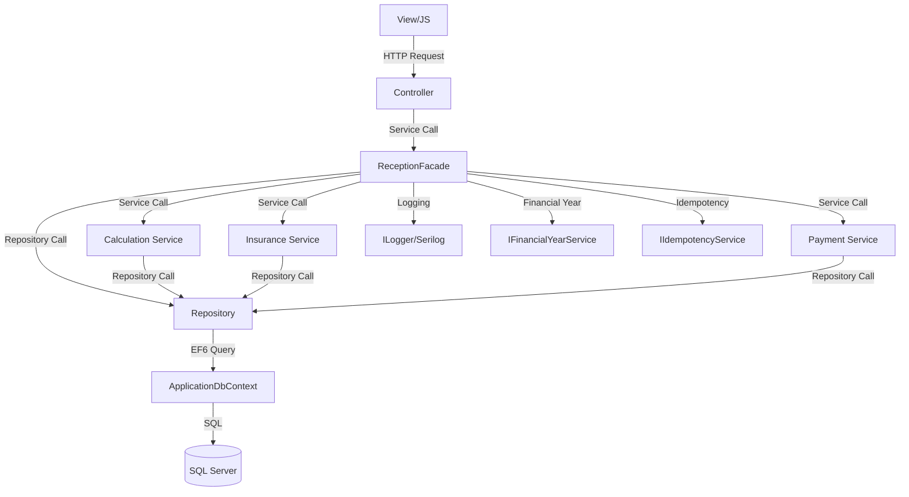

# 🔗 **نقشه وابستگی‌های لایه‌ها - ClinicApp**

**تاریخ ایجاد:** 2024  
**هدف:** نمایش وابستگی‌های بین لایه‌های معماری

---

## 📐 **معماری کلی (Clean Architecture)**

```
┌─────────────────────────────────────────────────────────┐
│           Presentation Layer (MVC Controllers)            │
│  Controllers/Reception/*, Controllers/Api/*              │
└──────────────────────────┬──────────────────────────────┘
                           │
                           ↓
┌─────────────────────────────────────────────────────────┐
│              Business Logic Layer (Services)            │
│  Services/Reception/ReceptionFacade.cs                  │
│  Services/Insurance/*, Services/Payment/*              │
└──────────────────────────┬──────────────────────────────┘
                           │
                           ↓
┌─────────────────────────────────────────────────────────┐
│           Data Access Layer (Repositories)               │
│  Repositories/Reception/*, Repositories/Patient/*        │
└──────────────────────────┬──────────────────────────────┘
                           │
                           ↓
┌─────────────────────────────────────────────────────────┐
│              Database Layer (Entity Framework)          │
│  ApplicationDbContext, Models/Entities/**                │
└─────────────────────────────────────────────────────────┘
```

---

## 🔄 **جریان داده در ماژول Reception V2**

### **1️⃣ Bootstrap (بارگذاری اولیه)**

```
View (ReceptionV2/Index.cshtml)
  ↓
Controller (ReceptionV2Controller.Index)
  ↓
ReceptionFacade.LoadInitialAsync()
  ↓
├─→ DepartmentRepository.GetActiveDepartmentsAsync()
├─→ ServiceRepository.GetSharedServicesAsync()
├─→ DoctorRepository.GetDoctorsByDepartmentAsync()
└─→ IFinancialYearService.GetCurrentYear()
```

### **2️⃣ Patient Lookup/Create**

```
View (JS: patient-lookup.js)
  ↓
POST /api/v1/reception/patient/lookup-or-create
  ↓
ReceptionApiController.PatientLookup()
  ↓
ReceptionFacade.FindOrCreatePatientAsync()
  ↓
├─→ PatientRepository.FindByNationalCodeAsync()
│   └─→ ApplicationDbContext.Patients.Where(...)
├─→ (اگر یافت نشد) PatientRepository.AddAsync()
└─→ PatientInsuranceRepository.GetByPatientIdAsync()
```

### **3️⃣ Create Draft**

```
View (JS: auto-draft-manager.js)
  ↓
POST /api/v1/reception/draft/create
  ↓
ReceptionApiController.CreateDraft()
  ↓
ReceptionFacade.CreateDraftAsync()
  ↓
├─→ IFinancialYearService.GetCurrentYear()
├─→ ReceptionRepository.AddAsync()
└─→ ApplicationDbContext.Receptions.Add()
```

### **4️⃣ Add Item**

```
View (JS: service-lookup.js)
  ↓
POST /api/v1/reception/item/add
  ↓
ReceptionApiController.AddItem()
  ↓
ReceptionFacade.AddItemAsync()
  ↓
├─→ ReceptionRepository.GetByIdAsync()
├─→ ServiceRepository.GetByIdAsync()
├─→ IServiceCalculationEngine.CalculateUnitPriceIRRAsync()
│   └─→ FactorSettingService.GetByFinancialYearAsync()
│   └─→ ServiceComponentRepository.GetByServiceIdAsync()
├─→ ICombinedInsuranceCalculationService.CalculateAsync()
│   └─→ InsuranceTariffRepository.GetByPlanAndServiceAsync()
└─→ ReceptionItemRepository.AddAsync()
```

### **5️⃣ Set Insurances**

```
View (JS: insurance-panel.js)
  ↓
POST /api/v1/reception/insurances/set
  ↓
ReceptionApiController.SetInsurances()
  ↓
ReceptionFacade.SetInsurancesAsync()
  ↓
├─→ ReceptionRepository.GetByIdAsync()
├─→ InsurancePlanRepository.GetByIdAsync() (Base)
├─→ InsurancePlanRepository.GetByIdAsync() (Supplementary)
└─→ ReceptionRepository.UpdateAsync()
```

### **6️⃣ Finalize (POS/Cash)**

```
View (JS: payment-panel.js)
  ↓
POST /api/v1/reception/finalize/pos (یا /finalize/cash)
  ↓
ReceptionApiController.FinalizeWithPos() (یا FinalizeWithCash())
  ↓
ReceptionFacade.FinalizePosAsync() (یا FinalizeCashAsync())
  ↓
├─→ ReceptionRepository.GetByIdAsync()
├─→ ReceptionFacade.RecalculateDraftAsync()
│   ├─→ ReceptionItemRepository.GetByReceptionIdAsync()
│   └─→ ICombinedInsuranceCalculationService.CalculateAsync()
├─→ IIdempotencyService.CheckAsync() (بررسی پرداخت تکراری)
├─→ PaymentTransactionRepository.AddAsync()
├─→ (POS) PosManagementService.ProcessPaymentAsync()
│   └─→ PosTerminalRepository.GetDefaultAsync()
├─→ ReceptionRepository.UpdateAsync() (Status = Completed)
└─→ ReceiptPrintRepository.AddAsync()
```

---

## 📊 **وابستگی‌های Service Layer**

### **ReceptionFacade وابستگی‌ها:**

```csharp
public class ReceptionFacade : IReceptionFacade
{
    // Repositories
    private readonly IReceptionRepository _receptionRepository;
    private readonly IReceptionItemRepository _receptionItemRepository;
    private readonly IPatientRepository _patientRepository;
    private readonly IServiceRepository _serviceRepository;
    private readonly IDepartmentRepository _departmentRepository;
    private readonly IDoctorRepository _doctorRepository;
    private readonly IPatientInsuranceRepository _patientInsuranceRepository;
    
    // Services
    private readonly IServiceCalculationEngine _serviceCalculationEngine;
    private readonly ICombinedInsuranceCalculationService _insuranceCalculationService;
    private readonly IPatientInsuranceService _patientInsuranceService;
    private readonly IPosManagementService _posManagementService;
    private readonly IFinancialYearService _financialYearService;
    private readonly IIdempotencyService _idempotencyService;
    
    // Others
    private readonly ApplicationDbContext _context;
    private readonly ILogger _logger;
    private readonly ICurrentUserService _currentUserService;
}
```

---

## 🔗 **وابستگی‌های Repository Layer**

### **BaseRepository Pattern:**

```csharp
public class BaseRepository<T> : IRepository<T> where T : class
{
    protected readonly ApplicationDbContext _context;
    
    public BaseRepository(ApplicationDbContext context)
    {
        _context = context;
    }
}
```

### **ReceptionRepository:**

```csharp
public class ReceptionRepository : BaseRepository<Reception>, IReceptionRepository
{
    public ReceptionRepository(ApplicationDbContext context) : base(context)
    {
    }
    
    // وابستگی به:
    // - ApplicationDbContext.Receptions
    // - ApplicationDbContext.Patients (Navigation)
    // - ApplicationDbContext.Doctors (Navigation)
    // - ApplicationDbContext.Departments (Navigation)
}
```

---

## 🔐 **وابستگی‌های Security**

### **Anti-Forgery Token Flow:**

```
View (@Html.AntiForgeryToken())
  ↓
Hidden Input: __RequestVerificationToken
  ↓
JS (reception-api.js)
  ↓
Header: RequestVerificationToken
  ↓
Controller ([ValidateAntiForgeryToken])
  ↓
ASP.NET MVC Anti-Forgery Validation
```

---

## 📝 **وابستگی‌های Logging**

### **Serilog Flow:**

```
Controller/Service/Repository
  ↓
ILogger (Injected)
  ↓
Serilog Logger
  ↓
├─→ Console (Development)
├─→ File (Production)
└─→ Seq (Production - Optional)
```

### **CorrelationId Flow:**

```
HTTP Request
  ↓
CorrelationIdFilter
  ↓
HttpContext.Items["CorrelationId"]
  ↓
ILogger.ForContext("CorrelationId", ...)
  ↓
Serilog Log Entry
```

---

## 🏦 **وابستگی‌های Financial Year**

### **Financial Year Service Flow:**

```
Service/Controller
  ↓
IFinancialYearService (Injected)
  ↓
DbFinancialYearService.GetCurrentYear()
  ↓
├─→ ApplicationDbContext.FactorSettings
│   └─→ OrderByDescending(f => f.FinancialYear)
│   └─→ Where(f => f.IsActiveForCurrentYear)
└─→ (Fallback) PersianCalendar
```

---

## 💰 **وابستگی‌های Payment**

### **POS Payment Flow:**

```
ReceptionFacade.FinalizePosAsync()
  ↓
IPosManagementService.ProcessPaymentAsync()
  ↓
├─→ PosTerminalRepository.GetDefaultAsync()
├─→ PosTerminal.IPAddress, Port, Provider
├─→ (External) POS Gateway API
└─→ PaymentTransactionRepository.AddAsync()
```

---

## 📊 **نمودار Mermaid ساده**



---

## ⚠️ **Circular Dependencies (عدم وجود)**

پروژه با Clean Architecture طراحی شده و **هیچ Circular Dependency** وجود ندارد:

- ✅ Presentation → Business Logic → Data Access → Database
- ✅ Services به Controllers وابسته نیستند
- ✅ Repositories به Services وابسته نیستند
- ✅ Entities فقط به Models.Core وابسته هستند

---

**تاریخ به‌روزرسانی:** 2024  
**نسخه:** 1.0

