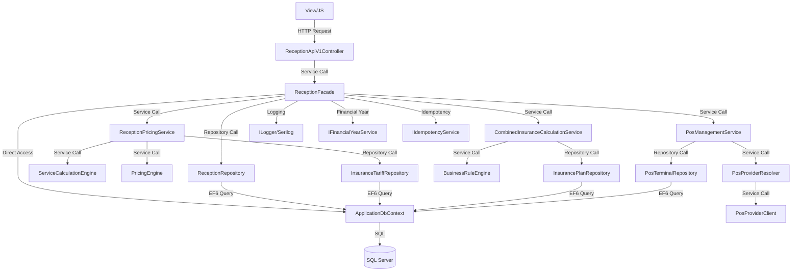

# 🔗 **نقشه وابستگی‌های لایه‌ها - Reception V2 Focus**

**تاریخ ایجاد:** 2025-01-27  
**هدف:** نمایش وابستگی‌های بین لایه‌های معماری با تمرکز بر ماژول Reception V2  
**نسخه:** 2.0.0

---

## 📐 **معماری کلی (Clean Architecture)**

```
┌─────────────────────────────────────────────────────────┐
│           Presentation Layer (MVC Controllers)            │
│  Controllers/ReceptionV2/*, Controllers/Api/*            │
└──────────────────────────┬──────────────────────────────┘
                           │
                           ↓
┌─────────────────────────────────────────────────────────┐
│              Business Logic Layer (Services)            │
│  Services/Reception/ReceptionFacade.cs                  │
│  Services/Reception/ReceptionPricingService.cs          │
│  Services/Insurance/*, Services/Payment/*               │
└──────────────────────────┬──────────────────────────────┘
                           │
                           ↓
┌─────────────────────────────────────────────────────────┐
│           Data Access Layer (Repositories)               │
│  Repositories/Reception/*, Repositories/Patient/*      │
│  Repositories/Insurance/*, Repositories/Payment/*       │
└──────────────────────────┬──────────────────────────────┘
                           │
                           ↓
┌─────────────────────────────────────────────────────────┐
│              Database Layer (Entity Framework)          │
│  ApplicationDbContext, Models/Entities/**                │
└─────────────────────────────────────────────────────────┘
```

---

## 🔄 **جریان داده در ماژول Reception V2**

### **1️⃣ Bootstrap (بارگذاری اولیه)**

```
View (ReceptionV2/Index.cshtml)
  ↓
Controller (ReceptionV2Controller.Index)
  ↓
GET /api/v1/reception/bootstrap?clinicId=&deptId=
  ↓
ReceptionApiV1Controller.Bootstrap()
  ↓
ReceptionFacade.LoadInitialAsync()
  ↓
├─→ ApplicationDbContext.Clinics (مستقیم - ⚠️)
├─→ IDepartmentManagementService.GetAllDepartmentsAsync()
│   └─→ DepartmentRepository.GetAllAsync()
│       └─→ ApplicationDbContext.Departments
├─→ ApplicationDbContext.Services (مستقیم - ⚠️)
├─→ IPosManagementService.GetActiveTerminalsAsync()
│   └─→ IPosTerminalRepository.GetActiveAsync()
│       └─→ ApplicationDbContext.PosTerminals
├─→ IFactorSettingService.GetCurrentAsync()
│   └─→ ApplicationDbContext.FactorSettings
└─→ IFinancialYearService.GetCurrentYear()
    └─→ ApplicationDbContext.FactorSettings
```

**⚠️ نقاط نیازمند بررسی:**
- دسترسی مستقیم به `ApplicationDbContext` در `ReceptionFacade` (باید از Repository استفاده شود)

---

### **2️⃣ Patient Lookup/Create**

```
View (JS: patient-lookup.js)
  ↓
POST /api/v1/reception/patient/lookup-or-create
  ↓
ReceptionApiV1Controller.PatientLookup()
  ↓
ReceptionFacade.FindOrCreatePatientAsync()
  ↓
├─→ IPatientService.FindByNationalCodeAsync()
│   └─→ IPatientRepository.FindByNationalCodeAsync()
│       └─→ ApplicationDbContext.Patients.Where(...)
├─→ (اگر یافت نشد) IPatientService.CreateAsync()
│   └─→ IPatientRepository.AddAsync()
│       └─→ ApplicationDbContext.Patients.Add()
└─→ IPatientInsuranceService.GetByPatientIdAsync()
    └─→ IPatientInsuranceRepository.GetByPatientIdAsync()
        └─→ ApplicationDbContext.PatientInsurances
```

---

### **3️⃣ Create Draft**

```
View (JS: auto-draft-manager.js)
  ↓
POST /api/v1/reception/draft/create
  ↓
ReceptionApiV1Controller.CreateDraft()
  ↓
ReceptionFacade.CreateDraftAsync()
  ↓
├─→ IFinancialYearService.GetCurrentYear()
│   └─→ ApplicationDbContext.FactorSettings
├─→ IReceptionRepository.AddAsync()
│   └─→ ApplicationDbContext.Receptions.Add()
└─→ ApplicationDbContext.SaveChangesAsync()
```

---

### **4️⃣ Add Item**

```
View (JS: service-lookup.js)
  ↓
POST /api/v1/reception/item/add
  ↓
ReceptionApiV1Controller.AddItem()
  ↓
ReceptionFacade.AddItemAsync()
  ↓
├─→ IReceptionRepository.GetByIdAsync()
│   └─→ ApplicationDbContext.Receptions.Find(...)
├─→ IServiceRepository.GetByIdAsync()
│   └─→ ApplicationDbContext.Services.Find(...)
├─→ IReceptionPricingService.PriceItemAsync()
│   ├─→ ServiceCalculationEngine.CalculateUnitPriceIRRAsync()
│   │   ├─→ IFactorSettingService.GetCurrentAsync()
│   │   └─→ IServiceRepository.GetComponentsAsync()
│   ├─→ ICombinedInsuranceCalculationService.CalculateAsync()
│   │   ├─→ IInsuranceTariffRepository.GetByPlanAndServiceAsync()
│   │   ├─→ IBusinessRuleEngine.EvaluateAsync()
│   │   └─→ IInsurancePlanRepository.GetByIdAsync()
│   └─→ IPricingEngine.CalculateAsync()
│       └─→ ITariffResolver.ResolveAsync()
└─→ IReceptionRepository.AddItemAsync()
    └─→ ApplicationDbContext.ReceptionItems.Add()
```

---

### **5️⃣ Set Insurances**

```
View (JS: insurance-panel.js)
  ↓
POST /api/v1/reception/insurances/set
  ↓
ReceptionApiV1Controller.SetInsurances()
  ↓
ReceptionFacade.SetInsurancesAsync()
  ↓
├─→ IReceptionRepository.GetByIdAsync()
│   └─→ ApplicationDbContext.Receptions.Find(...)
├─→ IInsurancePlanRepository.GetByIdAsync() (Base)
│   └─→ ApplicationDbContext.InsurancePlans.Find(...)
├─→ IInsurancePlanRepository.GetByIdAsync() (Supplementary)
│   └─→ ApplicationDbContext.InsurancePlans.Find(...)
├─→ IReceptionRepository.UpdateAsync()
│   └─→ ApplicationDbContext.Receptions.Update(...)
└─→ IReceptionPricingService.RepriceAllAsync()
    ├─→ IReceptionRepository.GetItemsAsync()
    │   └─→ ApplicationDbContext.ReceptionItems.Where(...)
    └─→ IReceptionPricingService.PriceItemAsync() (برای هر آیتم)
```

---

### **6️⃣ Get Doctors by Department**

```
View (JS: clinic-dept-doctor.js)
  ↓
GET /api/v1/reception/doctors/by-department?deptId=
  ↓
ReceptionApiV1Controller.GetDoctorsByDepartment()
  ↓
ReceptionFacade.GetDoctorsByDepartmentAsync()
  ↓
├─→ IDoctorManagementRepository.GetByDepartmentAsync()
│   └─→ ApplicationDbContext.DoctorDepartments
│       .Where(dd => dd.DepartmentId == deptId)
│       .Include(dd => dd.Doctor)
└─→ IDoctorServiceCategoryRepository.GetByDoctorAsync()
    └─→ ApplicationDbContext.DoctorServiceCategories
        .Where(dsc => dsc.DoctorId == doctorId)
```

---

### **7️⃣ Get Doctors by Service**

```
View (JS: clinic-dept-doctor.js)
  ↓
GET /api/v1/reception/doctors/by-service?deptId=&serviceId=
  ↓
ReceptionApiV1Controller.GetDoctorsByService()
  ↓
ReceptionFacade.GetDoctorsByServiceAsync()
  ↓
├─→ IDoctorServiceCategoryRepository.GetByServiceAsync()
│   └─→ ApplicationDbContext.DoctorServiceCategories
│       .Where(dsc => dsc.ServiceCategoryId == serviceId)
│       .Include(dsc => dsc.Doctor)
├─→ IDoctorDepartmentRepository.GetByDoctorAndDepartmentAsync()
│   └─→ ApplicationDbContext.DoctorDepartments
│       .Where(dd => dd.DoctorId == doctorId && dd.DepartmentId == deptId)
└─→ Validation: بررسی مجاز بودن پزشک برای خدمت
```

---

### **8️⃣ Finalize (POS/Cash)**

```
View (JS: payment-panel.js)
  ↓
POST /api/v1/reception/finalize/pos (یا /finalize/cash)
  ↓
ReceptionApiV1Controller.FinalizePos() (یا FinalizeCash())
  ↓
ReceptionFacade.FinalizePosAsync() (یا FinalizeCashAsync())
  ↓
├─→ IReceptionRepository.GetByIdAsync()
│   └─→ ApplicationDbContext.Receptions.Find(...)
├─→ IReceptionPricingService.CalculateTotalsAsync()
│   ├─→ IReceptionRepository.GetItemsAsync()
│   │   └─→ ApplicationDbContext.ReceptionItems.Where(...)
│   └─→ IReceptionPricingService.PriceItemAsync() (برای هر آیتم)
├─→ IIdempotencyService.CheckAsync() (بررسی پرداخت تکراری)
│   └─→ InMemoryIdempotencyService (In-Memory Cache)
├─→ IPaymentTransactionRepository.AddAsync()
│   └─→ ApplicationDbContext.PaymentTransactions.Add()
├─→ (POS) IPosManagementService.ProcessPaymentAsync()
│   ├─→ IPosTerminalRepository.GetDefaultAsync()
│   │   └─→ ApplicationDbContext.PosTerminals.Where(...)
│   ├─→ IPosProviderClient.ChargeAsync() (External API)
│   └─→ IPaymentTransactionRepository.UpdateAsync()
│       └─→ ApplicationDbContext.PaymentTransactions.Update(...)
├─→ IReceptionRepository.UpdateAsync() (Status = Completed)
│   └─→ ApplicationDbContext.Receptions.Update(...)
└─→ ApplicationDbContext.SaveChangesAsync()
```

---

## 📊 **وابستگی‌های Service Layer - Reception V2**

### **ReceptionFacade وابستگی‌ها:**

```csharp
public class ReceptionFacade : IReceptionFacade
{
    // Services
    private readonly IServiceCalculationService _serviceCalculationService;
    private readonly ServiceCalculationEngine _serviceCalculationEngine;
    private readonly ICombinedInsuranceCalculationService _combinedInsuranceCalculationService;
    private readonly IReceptionWorkflowService _receptionWorkflowService;
    private readonly IDepartmentManagementService _departmentManagementService;
    private readonly IPatientService _patientService;
    private readonly IPatientInsuranceService _patientInsuranceService;
    private readonly IPosManagementService _posManagementService;
    private readonly IFinancialYearService _financialYearService;
    private readonly InsurancePlanSuggestionService _insurancePlanSuggestionService;
    private readonly IFactorSettingService _factorSettingService;
    private readonly IPricingEngine _pricingEngine;
    private readonly IReceptionPricingService _receptionPricingService;
    
    // Repositories
    private readonly IReceptionRepository _receptionRepository;
    
    // Others
    private readonly ICurrentUserService _currentUserService;
    private readonly ApplicationDbContext _context; // ⚠️ دسترسی مستقیم
    private readonly ILogger _logger;
}
```

**⚠️ نقاط نیازمند بررسی:**
- دسترسی مستقیم به `ApplicationDbContext` در `ReceptionFacade` (باید از Repository استفاده شود)

---

### **ReceptionPricingService وابستگی‌ها:**

```csharp
public class ReceptionPricingService : IReceptionPricingService
{
    // Services
    private readonly IServiceCalculationService _serviceCalculationService;
    private readonly ServiceCalculationEngine _serviceCalculationEngine;
    private readonly ICombinedInsuranceCalculationService _combinedInsuranceCalculationService;
    private readonly IPricingEngine _pricingEngine;
    private readonly ITariffResolver _tariffResolver;
    private readonly IInsuranceCoverageProvider _coverageProvider;
    
    // Repositories
    private readonly IReceptionRepository _receptionRepository;
    private readonly IServiceRepository _serviceRepository;
    private readonly IInsuranceTariffRepository _insuranceTariffRepository;
    private readonly IInsurancePlanRepository _insurancePlanRepository;
    private readonly IBusinessRuleRepository _businessRuleRepository;
    
    // Others
    private readonly ApplicationDbContext _context; // ⚠️ دسترسی مستقیم
    private readonly ILogger _logger;
}
```

---

## 🔗 **وابستگی‌های Repository Layer**

### **BaseRepository Pattern:**

```csharp
public abstract class BaseRepository<T> : IBaseRepository<T> where T : class
{
    protected readonly ApplicationDbContext _context;
    
    public BaseRepository(ApplicationDbContext context)
    {
        _context = context;
    }
}
```

### **ReceptionRepository:**

```csharp
public class ReceptionRepository : BaseRepository<Reception>, IReceptionRepository
{
    public ReceptionRepository(ApplicationDbContext context) : base(context)
    {
    }
    
    // وابستگی به:
    // - ApplicationDbContext.Receptions
    // - ApplicationDbContext.Patients (Navigation)
    // - ApplicationDbContext.Doctors (Navigation)
    // - ApplicationDbContext.Departments (Navigation)
    // - ApplicationDbContext.ReceptionItems (Navigation)
}
```

### **PosTerminalRepository:**

```csharp
public class PosTerminalRepository : BaseRepository<PosTerminal>, IPosTerminalRepository
{
    public PosTerminalRepository(ApplicationDbContext context) : base(context)
    {
    }
    
    // وابستگی به:
    // - ApplicationDbContext.PosTerminals
}
```

---

## 🔐 **وابستگی‌های Security - CSRF**

### **Anti-Forgery Token Flow:**

```
View (@Html.AntiForgeryToken())
  ↓
Hidden Input: __RequestVerificationToken
  ↓
JS (reception-api.js)
  ↓
Header: RequestVerificationToken (یا X-RequestVerificationToken)
  ↓
Controller ([ValidateAntiForgeryTokenOnPosts])
  ↓
ValidateAntiForgeryTokenOnPostsAttribute.OnAuthorization()
  ↓
├─→ (Ajax) AntiForgery.Validate(cookieToken, formToken)
│   └─→ JSON 400 با کد ANTIFORGERY_MISSING
└─→ (Form) AntiForgery.Validate()
    └─→ Redirect با TempData["ErrorMessage"]
```

---

## 📝 **وابستگی‌های Logging**

### **Serilog Flow:**

```
Controller/Service/Repository
  ↓
ILogger (Injected via Unity)
  ↓
Serilog.Logger (Singleton)
  ↓
├─→ Console (Development)
├─→ File (Production)
└─→ Seq (Production - Optional)
```

### **CorrelationId Flow:**

```
HTTP Request
  ↓
CorrelationIdFilter
  ↓
HttpContext.Items["CorrelationId"]
  ↓
ILogger.ForContext("CorrelationId", ...)
  ↓
Serilog Log Entry
```

---

## 🏦 **وابستگی‌های Financial Year**

### **Financial Year Service Flow:**

```
Service/Controller
  ↓
IFinancialYearService (Injected via Unity)
  ↓
DbFinancialYearService.GetCurrentYear()
  ↓
├─→ ApplicationDbContext.FactorSettings
│   └─→ OrderByDescending(f => f.FinancialYear)
│   └─→ Where(f => f.IsActiveForCurrentYear)
└─→ (Fallback) PersianCalendar
```

---

## 💰 **وابستگی‌های Payment - POS**

### **POS Payment Flow:**

```
ReceptionFacade.FinalizePosAsync()
  ↓
IPosManagementService.ProcessPaymentAsync()
  ↓
├─→ IPosTerminalRepository.GetDefaultAsync()
│   └─→ ApplicationDbContext.PosTerminals.Where(t => t.IsDefault)
├─→ IPosProviderResolver.ResolveAsync(provider)
│   └─→ IPosProviderClient (FakePosClient یا RealPosClient)
├─→ IPosProviderClient.ChargeAsync(amount, terminal)
│   └─→ (External) POS Gateway API
├─→ IPaymentTransactionRepository.AddAsync()
│   └─→ ApplicationDbContext.PaymentTransactions.Add()
└─→ IPaymentTransactionRepository.UpdateAsync()
    └─→ ApplicationDbContext.PaymentTransactions.Update(...)
```

**⚠️ نقاط نیازمند بررسی:**
- بررسی وجود `IPosProviderResolver` و `IPosProviderClient`
- بررسی وجود `FakePosClient` برای تست
- بررسی وجود `PosPaymentService` برای مدیریت پرداخت POS

---

## 📊 **نمودار Mermaid - Reception V2**



---

## ⚠️ **Circular Dependencies (بررسی)**

### **✅ عدم وجود Circular Dependencies:**

پروژه با Clean Architecture طراحی شده و **هیچ Circular Dependency** وجود ندارد:

- ✅ Presentation → Business Logic → Data Access → Database
- ✅ Services به Controllers وابسته نیستند
- ✅ Repositories به Services وابسته نیستند
- ✅ Entities فقط به Models.Core وابسته هستند

### **⚠️ Dependency Leaks (نشت وابستگی):**

**1. دسترسی مستقیم به ApplicationDbContext در ReceptionFacade:**
- ⚠️ `ReceptionFacade` مستقیماً از `_context` استفاده می‌کند
- ✅ **Fix:** باید از Repository Pattern استفاده کند
- **Impact:** کاهش Testability و افزایش Coupling
- **Test:** Mock کردن `ApplicationDbContext` در Unit Tests

**2. دسترسی مستقیم به ApplicationDbContext در ReceptionPricingService:**
- ⚠️ `ReceptionPricingService` مستقیماً از `_context` استفاده می‌کند
- ✅ **Fix:** باید از Repository Pattern استفاده کند
- **Impact:** کاهش Testability و افزایش Coupling
- **Test:** Mock کردن `ApplicationDbContext` در Unit Tests

---

## 🔍 **نقاط چرخه (Cycle Points) - بررسی**

### **✅ عدم وجود چرخه:**

- ✅ Controller → Service → Repository → DbContext (یک‌طرفه)
- ✅ Service → Service (فقط از طریق Interface)
- ✅ Repository → Repository (فقط از طریق Interface)

---

## 📋 **چک‌لیست وابستگی‌ها**

### **✅ وابستگی‌های ثبت شده در Unity:**

- ✅ `IReceptionFacade` → `ReceptionFacade`
- ✅ `IReceptionPricingService` → `ReceptionPricingService`
- ✅ `IPosManagementService` → `PosManagementService`
- ✅ `IPosTerminalRepository` → `PosTerminalRepository`
- ✅ `IPaymentTransactionRepository` → `PaymentTransactionRepository`
- ✅ `ILogger` → `Serilog.ILogger`
- ✅ `ICombinedInsuranceCalculationService` → `CombinedInsuranceCalculationService`
- ✅ `IServiceCalculationService` → `ServiceCalculationService`
- ✅ `ServiceCalculationEngine` → `ServiceCalculationEngine`
- ✅ `IPricingEngine` → `PricingEngine`

### **⚠️ وابستگی‌های نیازمند بررسی:**

- ⚠️ `IPosProviderResolver` → `PosProviderResolver` (نیاز به بررسی وجود)
- ⚠️ `IPosProviderClient` → `FakePosClient` (نیاز به بررسی وجود)
- ⚠️ `IPosPaymentService` → `PosPaymentService` (نیاز به بررسی وجود)

---

**تاریخ به‌روزرسانی:** 2025-01-27  
**نسخه:** 2.0.0  
**وضعیت:** ✅ فاز A تکمیل شد
