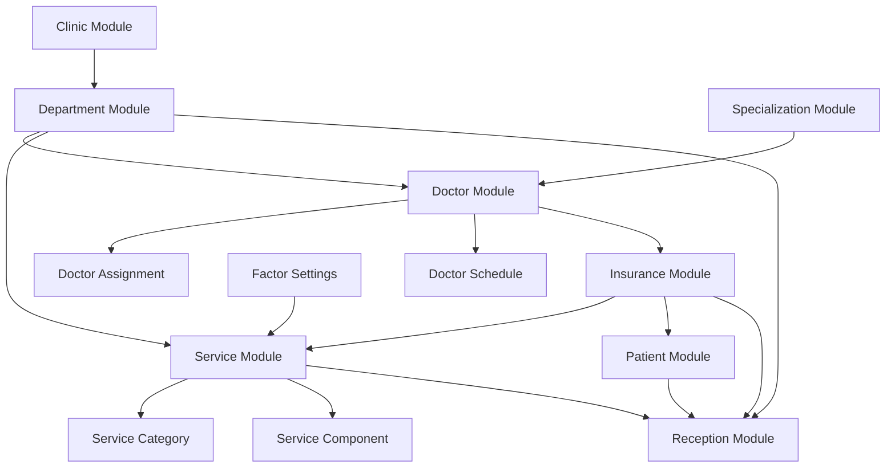

# 🏥 گزارش جامع تحلیل Area Admin

**تاریخ تحلیل**: 2025-11-29  
**نوع تحلیل**: عمیق، سیستماتیک، ماژول به ماژول  
**طبق**: قراردادهای پروژه  

---

## 📋 خلاصه اجرایی

Area Admin سیستم **جامع و پیچیده** مدیریت بخش‌های اداری کلینیک است که با معماری **Clean** و الگوهای **Repository + Service** طراحی شده است.

### آمار کلی:
- **Controllers**: 35 کنترلر
- **Services**: 13 سرویس تخصصی
- **Repositories**: 11 مخزن
- **View Folders**: 34 پوشه
- **Routing Rules**: 15+ قانون مسیریابی

---

## 1️⃣ ساختار کلی

### A. Controllers (35 کنترلر)

```
Areas/Admin/Controllers/
├── BaseController.cs (پایه)
├── 📂 Doctor Management (11 Controllers)
│   ├── DoctorController.cs
│   ├── DoctorAssignmentController.cs
│   ├── DoctorDepartmentController.cs
│   ├── DoctorServiceCategoryController.cs
│   ├── DoctorScheduleController.cs
│   ├── DoctorHistoryController.cs
│   ├── DoctorRemovalController.cs
│   ├── DoctorReportingController.cs
│   ├── DoctorDashboardController.cs
│   └── ...
│
├── 📂 Insurance (9 Controllers در subfolder)
│   ├── InsuranceProviderController.cs
│   ├── InsurancePlanController.cs
│   ├── InsuranceTariffController.cs (198 KB)
│   ├── PatientInsuranceController.cs (189 KB)
│   ├── SupplementaryTariffController.cs (172 KB)
│   ├── BusinessRuleController.cs
│   ├── InsuranceCalculationController.cs
│   ├── CombinedInsuranceCalculationController.cs
│   └── PatientInsuranceManagementController.cs
│
├── 📂 Service Management (5 Controllers)
│   ├── ServiceController.cs (81 KB)
│   ├── ServiceManagementController.cs
│   ├── ServiceComponentController.cs
│   ├── ServiceTemplateController.cs
│   └── SharedServiceController.cs (50 KB)
│
├── 📂 Clinic & Department (3 Controllers)
│   ├── ClinicController.cs
│   ├── ClinicBankAccountController.cs
│   └── DepartmentController.cs
│
├── 📂 Scheduling (3 Controllers)
│   ├── AppointmentAvailabilityController.cs
│   ├── ScheduleOptimizationController.cs
│   └── DoctorScheduleController.cs
│
├── 📂 Miscellaneous (4 Controllers)
│   ├── SpecializationController.cs
│   ├── FactorSettingController.cs
│   ├── EmergencyBookingController.cs
│   ├── InsuranceTypeUpdateController.cs
│   └── SystemSeedController.cs
│
└── 📂 Shared (1 Subfolder)
    └── BaseAssignmentController.cs
```

### B. Services (13 سرویس در ClinicAdmin)

```
Services/ClinicAdmin/
├── DoctorCrudService.cs (43 KB)
├── DoctorAssignmentService.cs (72 KB) ⭐
├── DoctorDepartmentService.cs (20 KB)
├── DoctorServiceCategoryService.cs (31 KB)
├── DoctorScheduleService.cs (27 KB)
├── DoctorDashboardService.cs (30 KB)
├── DoctorAssignmentHistoryService.cs (32 KB)
├── DoctorReportingService.cs (15 KB)
├── EmergencyBookingService.cs (24 KB)
├── ScheduleOptimizationService.cs (26 KB)
├── AppointmentAvailabilityService.cs (17 KB)
├── ClinicBankAccountService.cs (20 KB)
└── SpecializationService.cs (21 KB)
```

### C. Repositories (11 مخزن)

```
Repositories/ClinicAdmin/
├── DoctorCrudRepository.cs
├── DoctorAssignmentRepository.cs
├── DoctorAssignmentHistoryRepository.cs
├── IDoctorAssignmentHistoryRepository.cs (Interface)
├── DoctorDepartmentRepository.cs
├── DoctorServiceCategoryRepository.cs
├── DoctorScheduleRepository.cs
├── DoctorDashboardRepository.cs
├── DoctorReportingRepository.cs
├── SpecializationRepository.cs
└── ClinicBankAccountRepository.cs
```

### D. Views (34 پوشه)

```
Areas/Admin/Views/
├── Doctor/ (4 views)
├── DoctorAssignment/ (8 views)
├── DoctorDepartment/ (2 views)
├── DoctorServiceCategory/ (5 views)
├── DoctorSchedule/ (6 views)
├── DoctorHistory/ (5 views)
├── DoctorRemoval/ (5 views)
├── DoctorReporting/ (4 views)
├── DoctorDashboard/ (5 views)
├── InsuranceProvider/ (6 views)
├── InsurancePlan/ (6 views)
├── InsuranceTariff/ (6 views)
├── PatientInsurance/ (9 views)
├── SupplementaryTariff/ (9 views)
├── Service/ (11 views)
├── ServiceComponent/ (5 views)
├── ServiceManagement/ (7 views)
├── Clinic/ (5 views)
├── Department/ (5 views)
├── Specialization/ (4 views)
├── FactorSetting/ (7 views)
└── ... (14 more)
```

---

## 2️⃣ تحلیل ماژول‌های اصلی

### 📋 ماژول 1: Doctor Management

**Controllers (11 کنترلر)**:
1. `DoctorController.cs` (34 KB) - CRUD پزشکان
2. `DoctorAssignmentController.cs` (66 KB) ⭐ - مدیریت انتسابات
3. `DoctorDepartmentController.cs` (47 KB) - انتساب به دپارتمان
4. `DoctorServiceCategoryController.cs` (86 KB) ⭐ - انتساب به دسته خدمات
5. `DoctorScheduleController.cs` (47 KB) - مدیریت برنامه
6. `DoctorHistoryController.cs` (42 KB) - تاریخچه تغییرات
7. `DoctorRemovalController.cs` (31 KB) - حذف انتسابات
8. `DoctorReportingController.cs` (22 KB) - گزارش‌گیری
9. `DoctorDashboardController.cs` (13 KB) - داشبورد پزشک
10. `EmergencyBookingController.cs` (13 KB) - رزرو اورژانسی
11. `ScheduleOptimizationController.cs` (15 KB) - بهینه‌سازی برنامه

**Services (7 سرویس)**:
- `DoctorCrudService` - CRUD پایه
- `DoctorAssignmentService` (72 KB) ⭐ - منطق انتساب
- `DoctorDepartmentService` - مدیریت دپارتمان
- `DoctorServiceCategoryService` - مدیریت دسته خدمات
- `DoctorScheduleService` - مدیریت برنامه
- `DoctorDashboardService` - داده‌های داشبورد
- `DoctorReportingService` - گزارش‌ها

**Repositories (7 مخزن)**:
- `DoctorCrudRepository`
- `DoctorAssignmentRepository`
- `DoctorDepartmentRepository`
- `DoctorServiceCategoryRepository`
- `DoctorScheduleRepository`
- `DoctorDashboardRepository`
- `DoctorReportingRepository`

**قابلیت‌های کلیدی**:
✅ CRUD پزشکان
✅ انتساب به دپارتمان‌ها
✅ انتساب به دسته خدمات
✅ مدیریت برنامه کاری
✅ تاریخچه تغییرات (History Tracking)
✅ حذف کنترل شده انتسابات
✅ گزارش‌گیری جامع
✅ داشبورد تحلیلی

**ارتباطات**:
```
Doctor Module
    ↓ استفاده
Department Module (انتساب دپارتمان)
    ↓ استفاده
Service Module (انتساب دسته خدمات)
    ↓ استفاده
Specialization Module (تخصص پزشک)
    ↓ استفاده
Clinic Module (کلینیک پزشک)
```

---

### 💳 ماژول 2: Insurance Management

**Controllers (9 کنترلر در subfolder)**:
1. `InsuranceProviderController.cs` (21 KB) - مدیریت ارائه‌دهندگان
2. `InsurancePlanController.cs` (35 KB) - مدیریت پلن‌ها
3. `InsuranceTariffController.cs` (198 KB) ⭐⭐ - تعرفه‌ها
4. `PatientInsuranceController.cs` (189 KB) ⭐⭐ - بیمه بیمار
5. `SupplementaryTariffController.cs` (172 KB) ⭐⭐ - تعرفه تکمیلی
6. `BusinessRuleController.cs` (21 KB) - قوانین کسب‌وکار
7. `InsuranceCalculationController.cs` (87 KB) - محاسبات بیمه
8. `CombinedInsuranceCalculationController.cs` (54 KB) - محاسبات ترکیبی
9. `PatientInsuranceManagementController.cs` (18 KB) - مدیریت بیمه بیمار

**Services (موجود در Services/Insurance/)**:
- `InsurancePlanService`
- `InsuranceProviderService`
- `InsuranceTariffService`
- `BusinessRuleService`
- `AdvancedInsuranceCalculationService`
- `CombinedInsuranceCalculationService`
- `ServiceCalculationEngine`
- `BusinessRuleEngine`

**Repositories (7 مخزن)**:
- `InsuranceProviderRepository`
- `InsurancePlanRepository`
- `InsuranceTariffRepository`
- `PatientInsuranceRepository`
- `BusinessRuleRepository`
- `InsuranceCalculationRepository`
- `PlanServiceRepository`

**قابلیت‌های کلیدی**:
✅ مدیریت ارائه‌دهندگان بیمه
✅ مدیریت پلن‌های بیمه (پایه و تکمیلی)
✅ تعرفه‌های بیمه (Base + Supplementary)
✅ قوانین کسب‌وکار پویا
✅ محاسبات پیشرفته بیمه
✅ محاسبات ترکیبی (Base + Supplementary)
✅ مدیریت بیمه بیماران
✅ Bulk Operations (عملیات گروهی)

**ارتباطات**:
```
Insurance Module
    ↓ استفاده
Service Module (تعرفه خدمات)
    ↓ استفاده
Patient Module (بیمه بیمار)
    ↓ استفاده
Reception Module (محاسبه در پذیرش)
```

---

### 🔧 ماژول 3: Service Management

**Controllers (5 کنترلر)**:
1. `ServiceController.cs` (81 KB) ⭐ - CRUD خدمات
2. `ServiceManagementController.cs` (8 KB) - مدیریت کلی
3. `ServiceComponentController.cs` (39 KB) - مؤلفه‌های خدمت
4. `ServiceTemplateController.cs` (26 KB) - الگوهای خدمت
5. `SharedServiceController.cs` (50 KB) - خدمات مشترک

**Services**:
- `ServiceManagementService`
- `ServiceCategoryService`
- `ServiceComponentService`
- `SharedServiceService`

**Repositories**:
- `ServiceRepository`
- `ServiceCategoryRepository`

**قابلیت‌های کلیدی**:
✅ CRUD خدمات
✅ دسته‌بندی خدمات
✅ مؤلفه‌های خدمت (Components)
✅ الگوهای خدمت (Templates)
✅ خدمات مشترک بین دپارتمان‌ها
✅ قیمت‌گذاری خدمات
✅ محاسبه Factor

**ارتباطات**:
```
Service Module
    ↓ استفاده
Department Module (خدمات دپارتمان)
    ↓ استفاده
Doctor Module (خدمات پزشک)
    ↓ استفاده
Insurance Module (تعرفه بیمه)
    ↓ استفاده
Reception Module (استفاده در پذیرش)
```

---

### 🏢 ماژول 4: Department Management

**Controllers (1 کنترلر)**:
- `DepartmentController.cs` (13 KB)

**Services**:
- `DepartmentService`

**Repositories**:
- `DepartmentRepository`

**قابلیت‌های کلیدی**:
✅ CRUD دپارتمان‌ها
✅ مدیریت سلسله مراتب
✅ فعال/غیرفعال‌سازی

**ارتباطات**:
```
Department Module
    ↑ استفاده شده توسط
Doctor Module (انتساب پزشک)
    ↑ استفاده شده توسط
Service Module (خدمات دپارتمان)
    ↑ استفاده شده توسط
Clinic Module (دپارتمان کلینیک)
```

---

### 🏥 ماژول 5: Clinic Management

**Controllers (2 کنترلر)**:
- `ClinicController.cs` (11 KB)
- `ClinicBankAccountController.cs` (15 KB)

**Services**:
- `ClinicService`
- `ClinicBankAccountService`

**Repositories**:
- `ClinicRepository`
- `ClinicBankAccountRepository`

**قابلیت‌های کلیدی**:
✅ CRUD کلینیک‌ها
✅ مدیریت حساب‌های بانکی
✅ تنظیمات کلینیک

**ارتباطات**:
```
Clinic Module
    ↑ استفاده شده توسط
Department Module
    ↑ استفاده شده توسط  
Doctor Module
    ↑ استفاده شده توسط
Reception Module
```

---

### 🎓 ماژول 6: Specialization Management

**Controllers (1 کنترلر)**:
- `SpecializationController.cs` (17 KB)

**Services**:
- `SpecializationService`

**Repositories**:
- `SpecializationRepository`

**قابلیت‌های کلیدی**:
✅ CRUD تخصص‌ها
✅ مدیریت تخصص‌های پزشکی

**ارتباطات**:
```
Specialization Module
    ↑ استفاده شده توسط
Doctor Module (تخصص پزشک)
```

---

### ⚙️ ماژول 7: Factor & Settings

**Controllers (1 کنترلر)**:
- `FactorSettingController.cs` (47 KB)

**قابلیت‌های کلیدی**:
✅ مدیریت ضرایب (RVU, Geographical, Professional)
✅ تنظیمات قیمت‌گذاری

**ارتباطات**:
```
Factor Module
    ↑ استفاده شده توسط
Service Module (محاسبه قیمت)
    ↑ استفاده شده توسط
Insurance Module (محاسبه تعرفه)
```

---

## 3️⃣ نقشه ارتباطات بین ماژولی

### A. Dependency Graph



### B. Data Flow

```
User Request
    ↓
Admin Controller
    ↓
Service Layer (Business Logic)
    ↓
Repository Layer (Data Access)
    ↓
Entity Framework 6
    ↓
SQL Server Database
```

### C. Integration Points

| ماژول | ارتباط با | نوع ارتباط |
|-------|-----------|------------|
| Doctor | Department | Many-to-Many (Assignment) |
| Doctor | Service Category | Many-to-Many (Assignment) |
| Doctor | Specialization | Many-to-One |
| Service | Department | Many-to-One |
| Service | Category | Many-to-One |
| Insurance | Service | Many-to-Many (Tariff) |
| Insurance | Patient | One-to-Many |
| Reception | Doctor | Many-to-One |
| Reception | Service | Many-to-Many (Items) |
| Reception | Insurance | Many-to-One |

---

## 4️⃣ نقاط قوت

### ✅ معماری

1. **Clean Architecture**: جداسازی کامل لایه‌ها
2. **Repository Pattern**: دسترسی یکپارچه به داده
3. **Service Layer**: منطق کسب‌وکار متمرکز
4. **Area Separation**: جداسازی بخش Admin
5. **SOLID Principles**: رعایت اصول طراحی

### ✅ قابلیت‌ها

1. **Doctor Management**: سیستم جامع مدیریت پزشکان
2. **Assignment System**: انتساب پیشرفته با History
3. **Insurance System**: محاسبات پیچیده بیمه
4. **Service Management**: مدیریت کامل خدمات
5. **Routing**: مسیریابی پیشرفته

### ✅ کیفیت کد

1. **Dependency Injection**: Unity Container
2. **Logging**: Serilog
3. **Validation**: FluentValidation
4. **Authorization**: Role-Based Access
5. **ServiceResult Pattern**: مدیریت یکپارچه نتایج

---

## 5️⃣ موارد نیازمند بهبود

### 🔴 اولویت بالا

1. **Authorization در Controllers**
   - برخی Controllers فاقد `[Authorize]`
   - نیاز به بررسی دسترسی‌ها

2. **Dependency Check**
   - تکمیل `GetDoctorDependenciesAsync` در Controllers
   - بررسی وابستگی‌ها قبل از حذف

3. **Performance**
   - بررسی N+1 Queries
   - Caching Strategy

### 🟡 اولویت متوسط

1. **Unit Testing**
   - نوشتن تست برای Services
   - Integration Tests

2. **Documentation**
   - XML Comments
   - API Documentation

3. **Error Handling**
   - Centralized Exception Handler
   - User-friendly Messages

### 🟢 اولویت پایین

1. **Code Refactoring**
   - کاهش حجم Controllers بزرگ
   - DRY Principle

2. **UI/UX**
   - بهبود رابط کاربری

---

## 6️⃣ توصیه‌های بهینه‌سازی

### 1. Authorization

```csharp
// قبل:
public class DoctorController : Controller

// بعد:
[Authorize(Roles = "Admin,ClinicManager")]
public class DoctorController : Controller
```

### 2. Dependency Check

```csharp
// تکمیل GetDoctorDependenciesAsync
public async Task<ServiceResult<DoctorDependencyInfo>> GetDoctorDependenciesAsync(int doctorId)
{
    var departments = await _context.DoctorDepartments
        .Where(dd => dd.DoctorId == doctorId && dd.IsActive)
        .CountAsync();
        
    var serviceCategories = await _context.DoctorServiceCategories
        .Where(dsc => dsc.DoctorId == doctorId && dsc.IsActive)
        .CountAsync();
        
    var appointments = await _context.Appointments
        .Where(a => a.DoctorId == doctorId && a.Status == AppointmentStatus.Scheduled)
        .CountAsync();
        
    return ServiceResult<DoctorDependencyInfo>.Successful(new DoctorDependencyInfo
    {
        DepartmentCount = departments,
        ServiceCategoryCount = serviceCategories,
        ActiveAppointmentsCount = appointments,
        CanBeDeleted = departments == 0 && serviceCategories == 0 && appointments == 0
    });
}
```

### 3. Caching

```csharp
// افزودن Caching به Specialization
public async Task<List<Specialization>> GetActiveSpecializationsAsync()
{
    const string cacheKey = "active_specializations";
    
    if (_cache.TryGetValue(cacheKey, out List<Specialization> specializations))
        return specializations;
    
    specializations = await _context.Specializations
        .Where(s => s.IsActive && !s.IsDeleted)
        .ToListAsync();
    
    _cache.Set(cacheKey, specializations, TimeSpan.FromHours(1));
    
    return specializations;
}
```

---

## 7️⃣ فایل‌های کلیدی

### بزرگترین و مهم‌ترین:
1. `InsuranceTariffController.cs` (198 KB) ⭐⭐
2. `PatientInsuranceController.cs` (189 KB) ⭐⭐
3. `SupplementaryTariffController.cs` (172 KB) ⭐⭐
4. `DoctorServiceCategoryController.cs` (86 KB) ⭐
5. `ServiceController.cs` (81 KB) ⭐
6. `DoctorAssignmentService.cs` (72 KB) ⭐
7. `DoctorAssignmentController.cs` (66 KB)

---

## 8️⃣ نتیجه‌گیری

### ✅ وضعیت کلی: **عالی**

Area Admin یک سیستم **پیچیده، جامع و حرفه‌ای** است که با توجه به اصول معماری و الگوهای طراحی پیشرفته ساخته شده است.

### 🎯 امتیاز کلی: **8.5/10**

- **معماری**: 9/10 - Clean و اصولی
- **قابلیت‌ها**: 9/10 - جامع و کامل
- **کیفیت کد**: 8/10 - خوب با نیاز به بهبود جزئی
- **مستندات**: 7/10 - نیاز به تکمیل
- **Testing**: 6/10 - نیاز به Unit Tests

### 📋 اولویت‌های بهینه‌سازی:

1. **فوری**: Authorization + Dependency Check
2. **کوتاه‌مدت**: Unit Testing + Documentation
3. **بلندمدت**: Performance + Refactoring

---

**تاریخ**: 2025-11-29  
**تحلیلگر**: Senior .NET Architect  
**وضعیت**: ✅ تحلیل جامع کامل شده
